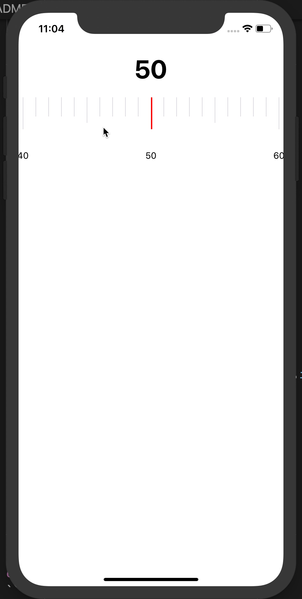

# React Native Scrub

A React Native number scrubber using React Native Gesture Handler

## Install

```
yarn add react-native-scrub react-native-gesture-handler

cd ios
pod install
```

## How To Use

`onUpdate` will return each scrub which should be used to update a display value.

`onChange` will return when the user stops scrubbing. This can be used to update the display, and update the value passed into the component again. If you adjust the value another way the `Scrubber` will spring to the new value.

`min` is the minimum value that is allowed

`max` is the maximum value that is allowed

`step` is how the scrubber should create the range from the `min` to the `max`.

`renderTick` will be called with the current index, step value, and allow you to control how each tick is rendered. You can use the one provided or write your own.


## Demo

```jsx
import React, { useState } from 'react';
import { SafeAreaView, View, Text } from 'react-native';
import { Slider, Tick, CenterLine } from 'react-native-scrub';

const App = () => {
  const [display, setDisplay] = useState(50);
  const [value, setValue] = useState(50);

  return (
    <SafeAreaView>
      <Text
        style={{
          paddingVertical: 20,
          fontSize: 40,
          fontWeight: 'bold',
          textAlign: 'center',
        }}
      >
        {display}
      </Text>
      <Slider
        min={10}
        max={100}
        step={1}
        value={value}
        onUpdate={v => {
          setDisplay(v);
        }}
        onChange={v => {
          setDisplay(v);
          setValue(v);
        }}
        renderTick={tick => <Tick key={tick.index} {...tick} />}
      >
        <CenterLine
          style={{
            backgroundColor: 'red',
          }}
        />
      </Slider>
    </SafeAreaView>
  );
};

export default App;
```


